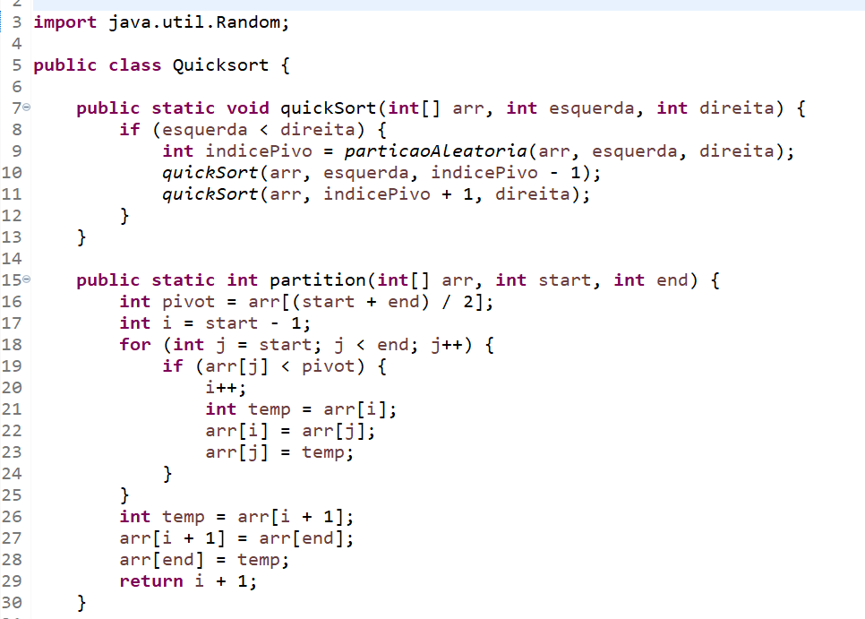
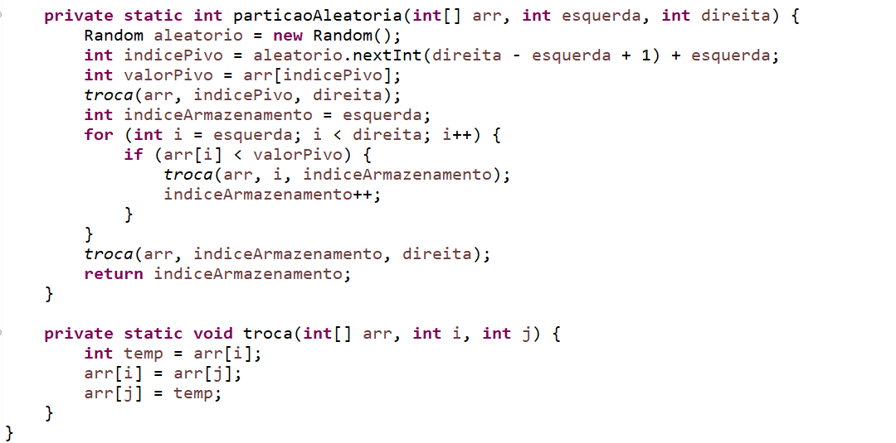
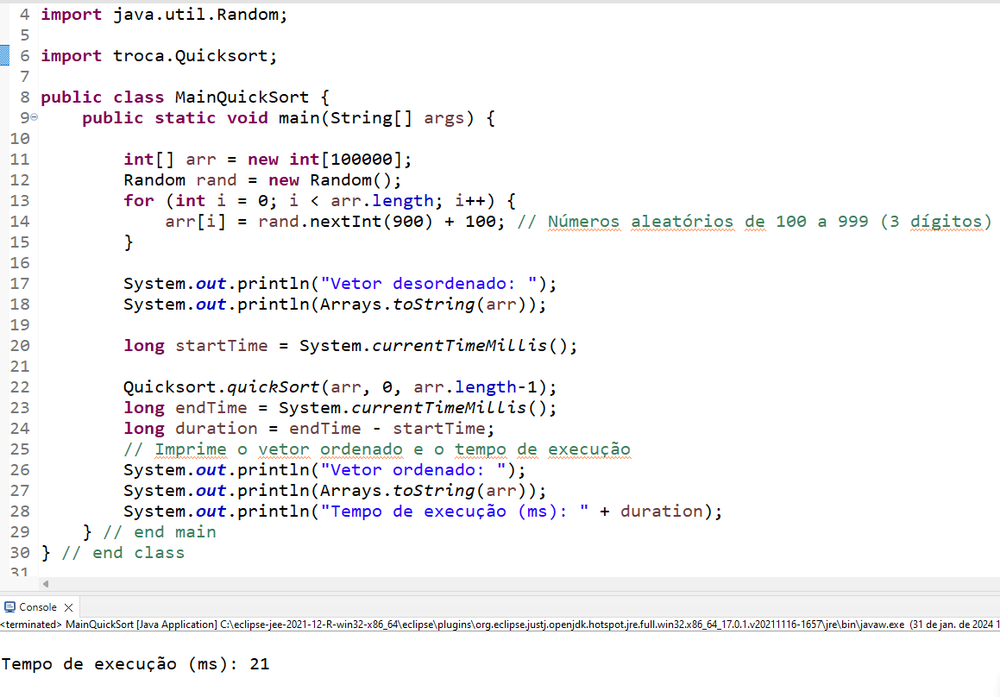

# Algoritmo De Ordenaçao QuickSort.

O algoritmo QuickSort é um eficiente algoritmo de ordenação que segue a abordagem "divide e conquista" para ordenar uma lista de elementos. Ele foi desenvolvido por Tony Hoare em 1959 e é amplamente utilizado devido à sua eficiência e velocidade em muitos casos.

- A ideia fundamental por trás do QuickSort é escolher um elemento pivô da lista e particionar os elementos ao redor desse pivô, de forma que os elementos menores que o pivô fiquem à esquerda e os elementos maiores à direita. Em seguida, o algoritmo é aplicado recursivamente às sublistas formadas antes e depois do pivô, até que toda a lista esteja ordenada.

- A escolha eficiente do pivô é crucial para o desempenho do QuickSort. Geralmente, o pivô é escolhido como o primeiro elemento da lista, mas também pode ser escolhido aleatoriamente ou como o elemento do meio. Uma estratégia comum é usar o método conhecido como "partição de Hoare" ou "partição de Lomuto" para particionar os elementos ao redor do pivô.

- O QuickSort possui uma complexidade de tempo médio de O(n log n) e uma complexidade de pior caso de O(n^2), onde n é o número de elementos na lista. No entanto, na prática, o QuickSort é geralmente mais rápido do que outros algoritmos de ordenação como o Merge Sort e o Heap Sort, devido à sua eficiência em partições de dados e baixo uso de memória auxiliar.

- Em resumo, o QuickSort é um algoritmo eficiente e amplamente utilizado para ordenação de listas, especialmente em situações onde o desempenho é crucial. Sua abordagem "divide e conquista" e escolha eficiente do pivô o tornam uma escolha popular em muitos cenários de ordenação.

# Código fonte

Esse código implementa o algoritmo de ordenação QuickSort em Java. Vamos analisar cada parte do código:

# Método quickSort:

- Recebe um array arr, um índice esquerda e um índice direita.
Se esquerda for menor que direita, realiza a ordenação.
Obtém o índice do pivô usando o método particaoAleatoria.
Chama recursivamente quickSort para as sublistas à esquerda e à direita do pivô.
Método partition:

- Recebe um array arr, um índice de início start e um índice de fim end.
Escolhe o pivô como o elemento do meio do array.
Usa uma abordagem de partição onde os elementos menores que o pivô são movidos para a esquerda, e os maiores para a direita.
Retorna o novo índice do pivô.
Método particaoAleatoria:

- Recebe um array arr, um índice esquerda e um índice direita.
Escolhe aleatoriamente um índice para o pivô e troca o valor do pivô com o valor na posição direita.
Realiza a partição, movendo os elementos menores que o pivô para a esquerda.
Retorna o novo índice do pivô.
Método troca:

- Recebe um array arr e dois índices i e j.
Troca os elementos nas posições i e j no array.
Funcionamento geral:

- O método quickSort inicia a ordenação chamando particaoAleatoria para obter o pivô inicial.
A escolha aleatória do pivô ajuda a evitar casos em que o QuickSort pode ter desempenho ruim em arrays quase ordenados.
A partição é realizada movendo os elementos menores que o pivô para a esquerda e os maiores para a direita.
A recursão continua nas sublistas à esquerda e à direita do pivô até que a lista esteja ordenada.
Em resumo, o código implementa uma versão do algoritmo QuickSort em Java, incorporando a escolha aleatória do pivô para melhorar o desempenho em cenários específicos.

# Main

# Execução do Algoritmo QuickSort - MainQuickSort

O código Java em `MainQuickSort` demonstra a aplicação do algoritmo QuickSort em um vetor de inteiros com 100.000 elementos. Aqui está uma explicação detalhada do código:

## Criação e Inicialização do Vetor:

Um vetor chamado `arr` com 100.000 elementos é criado para armazenar números inteiros.
Cada elemento do vetor recebe um valor aleatório entre 100 e 999 (inclusive), gerado usando a classe `Random`. Esses valores são gerados para simular um vetor desordenado.
Impressão do Vetor Desordenado:

O programa imprime no console a mensagem "Vetor desordenado:" seguida dos elementos do vetor desordenado. Isso permite que o usuário veja como o vetor estava antes de ser ordenado.
Ordenação do Vetor Usando QuickSort:

O programa inicia a contagem do tempo (startTime) antes de chamar o método `quickSort` da classe `Quicksort`, que contém a implementação do algoritmo QuickSort.
Após a ordenação, o programa registra o tempo novamente (endTime) e calcula a diferença para obter o tempo de execução (duration).
Impressão do Vetor Ordenado e Tempo de Execução:

O programa imprime no console a mensagem "Vetor ordenado:" seguida dos elementos do vetor após a aplicação do QuickSort.
Também imprime o tempo de execução em milissegundos.
No geral, esse código gera um vetor com valores aleatórios, o imprime desordenado, ordena esse vetor usando o algoritmo QuickSort e, finalmente, imprime o vetor ordenado e o tempo que levou para realizar essa ordenação.
